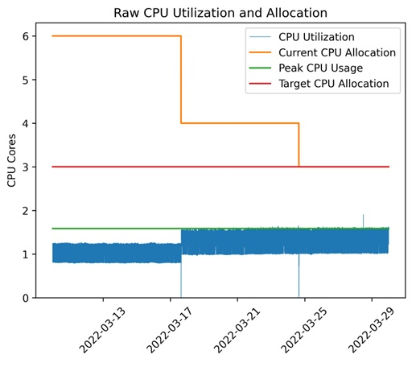

Google’s data centers around the world use about twice as much electricity as the city of San Francisco. At the same time, any Google data center is twice as energy efficient as a typical enterprise data center.C ompared with five years ago, Google now deliver around six times as much computing power with the same amount of electrical power. In 2020, the average annual Power Usage Effectiveness for the global fleet of data centers was 1.10, compared with the industry average of 1.593—meaning that Google data centers use about six times less overhead energy.

What is the success story behind it? How to make DC more cost efficient? Let's see few examples of AI/ML solutions:

- Machine learning for predicting resource allocation for better CPU/cores utilization (up to 20% reduction of cores on a global level, or savings of up to 3,000 hosts)
- Machine learning for predicting Power Usage Effectiveness (PUE) to reduce electricity costs (up to 40% reduction in energy or up to 15 percent reduction in overall Power Usage Effectiveness)
- Container Throttling Problem (up to 20% reduction of CPU usage and up to 40% reduction in memory usage) :
Linux kernel resource allocation mechanisms optimization
Reduction of overprovisioning to handle spikes due to CPU throttling to reduce core allocation

The impact mentioned above was achieved in FAANG type of companies. But looking at other industries, it's hard to imagine that the environment and maturity level will be the same as in Google or Meta.

Based on historical data that had already been collected by thousands of sensors within the data center, data such as temperatures, power, pump speeds, setpoints, etc. and using it to train an ensemble of deep neural networks Google was able to improve data center energy efficiency. 

They trained the neural networks on the average future PUE (Power Usage Effectiveness), which is defined as the ratio of the total building energy usage to the IT energy usage. They also trained two additional ensembles of deep neural networks to predict the future temperature and pressure of the data center over the next hour. The purpose of these predictions is to simulate the recommended actions from the PUE model, to ensure that they do not go beyond any operating constraints.

Jim Gao, Phaidra’s chief executive officer, calls manufacturing a sector ignored by Silicon Valley yet ripe for the kind of advanced machine learning cooked up in places like Google. “They’ve been collecting data for so long, but they haven’t been using it.”

In the majority of cases, the basic usage still represents tasks like data collection or creating dashboards. It may take weeks or months to take an action. It can be also situations, where insights are not used in decision-making. Moreover, budget constraints and lack of expertise can also be a roadblock to the implementation of AI or ML solutions. Outsourcing is also a constraint, as usually vendors are not happy about the automation/reduction of their work.

However, the industrial sector, which accounts for about a fourth of all US greenhouse gas emissions and continues to expand, is beginning to embrace AI/ML technologies. A report from IoT Analytics forecasts revenue from industrial AI to balloon to $72.5 billion by 2025.

But to make it successful, any sector should have clear expectations and be confident not to have these signs of failure for any AI/ML project:

- Lack of data strategy
- Lack of leadership support
- Not enough expertise
- Volume and quality of data
- Organizations are siloed
- Lack of collaboration
- Technically infeasible projects
- Alignment problem between technical and business teams

Only by addressing these issues before starting the new technology adoption companies may have success. And only by knowing the limitations of emerging technologies, the company can see the real value behind any AI-backed-up product.

[Why 87% of Machine learning Projects Fail](https://hackernoon.com/why-87percent-of-machine-learning-projects-fail-sp343uhj)
[Alums From Google's DeepMind Want to Bring AI Energy Controls to Industrial Giants](https://www.datacenterknowledge.com/sustainability/alums-googles-deepmind-want-bring-ai-energy-controls-industrial-giants)

