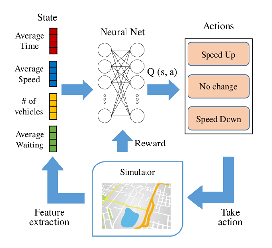

You can be surprised, but one of the first things that we call Artificial Intelligence was created more than 70 years ago. The first reinforcement learning algorithm was published in the 1950s by a group of researchers at the University of Michigan, including Herbert Simon and Richard Bellman. Their work built on earlier research in the field of control theory, which had been developed in the 1940s and 1950s. The algorithm they developed, known as the Bellman equation, is still widely used in reinforcement learning today.

Reinforcement learning is a type of machine learning that involves training agents to take actions in an environment to maximize a reward. It has been used in a variety of business applications, including supply chain optimization, product recommendation systems, and advertising.

### Most popular applications of Reinforcement Learning

Where these algorithms already brings a value? The first thing that comes to mind is personalizing user experiences. 

Reinforcement learning algorithms could be used to provide personalized recommendations and customized content to individual users based on their interests and preferences.

Optimizing online advertising: algorithm could be trained to maximize the effectiveness of online advertising campaigns by selecting the most effective ads and targeting them to the right audience.

Improving search results: algorithm could be used to improve the relevance and accuracy of search results, providing users with more relevant and helpful information.

Enhancing security and fraud detection: algorithm could be used to detect and prevent fraudulent activities, such as credit card fraud and identity theft.

Optimizing pricing and inventory management: algorithm could be trained to predict demand for products and adjust pricing and inventory levels accordingly, resulting in higher revenues and reduced costs.

Personalizing customer service: algorithm could be used to provide personalized responses to customer inquiries and complaints, improving the overall customer experience.

Improving supply chain management: we can use algorithms to optimize the supply chain, reducing costs and improving efficiency.

Enhancing user engagement: algorithm could be used to identify the most effective ways to engage users and keep them coming back to a website or app.

Improving recommendation systems: algorithm could be trained to provide more accurate and relevant product recommendations to users, resulting in higher conversion rates and revenues.

Enhancing user experience: here it could be used to improve the overall user experience on a website or app, making it easier and more enjoyable for users to find what they are looking for.

### What are the key components of reinforcement learning?

A typical reinforcement learning architecture involves several key components, including an agent, an environment, a reward function, and a set of actions.

The agent is the entity that takes actions in the environment. In a reinforcement learning system, the agent is typically a machine learning algorithm that is trained to take actions that maximize a reward.

The environment is the world in which the agent operates. This could be a virtual environment, such as a computer game, or a real-world environment, such as a manufacturing plant or a traffic system.

The reward function is a mathematical function that determines the value of the reward that the agent receives for taking a particular action. The goal of the reinforcement learning algorithm is to maximize the total reward it receives by selecting actions that result in the highest reward.

The set of actions available to the agent is determined by the environment and the specific task that the agent is trying to accomplish. For example, in a game of chess, the set of actions might include moving a piece to a specific square on the board.

Deep reinforcement learning architecture for tuning the vehicles' speeds in the simulator.Joint Modeling of Dense and Incomplete Trajectories for Citywide Traffic Volume Inference. Xianfeng Tang, Boqing Gong, Yanwei Yu. DOI:10.1145/3308558.3313621

The goal of a reinforcement learning system is to train the agent to take the most effective actions in a given environment in order to maximize the reward. This is typically achieved through a process of trial and error, in which the agent takes actions, receives feedback in the form of a reward, and learns from this feedback to improve its performance over time.

### What are the challenges with reinforcement learning?

The first one, is for sure - time. You have to perform complex and time consuming simulations to get score of your model.

Lack of interpretability and transparency. Algorithms can be complex and difficult to understand, which can make it challenging to interpret and explain their decisions and actions. This can lead to concerns about bias, fairness, and accountability, and can limit the ability of reinforcement learning algorithms to be trusted and adopted in real-world applications.

Difficulty in learning from sparse and noisy data. Reinforcement learning algorithms can struggle to learn from sparse and noisy data, which can make it difficult for them to perform well in complex and dynamic environments. This can limit the ability of reinforcement learning algorithms to adapt to new and changing situations, and can make it challenging to apply reinforcement learning to real-world problems.

Sensitivity to hyperparameters and initialization. It can be sensitive to the values of their hyperparameters and their initial conditions, which can affect their performance and stability. This can make it difficult to tune and optimize reinforcement learning algorithms, and can make it challenging to reproduce and compare their results.

Lack of scalability and efficiency. Algorithms can be computationally expensive and resource-intensive, which can limit their ability to be applied to large-scale and real-time applications. This can make it challenging to apply reinforcement learning to complex and high-dimensional problems, and can limit the ability of reinforcement learning algorithms to be deployed in real-world environments.

