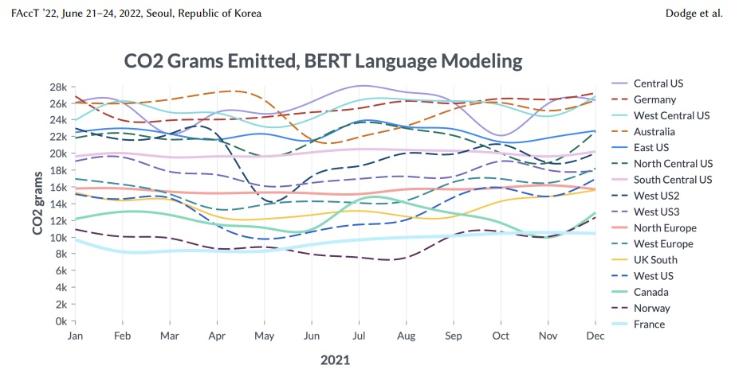
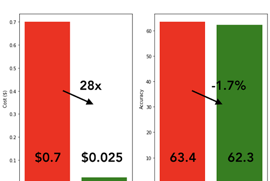

What does sustainable AI/ML look like? How to measure carbon emissions, and at the same time, how to reduce energy consumption? These questions have become one of the hottest topics recently due to multiple factors, including all-time high energy prices, economic turmoil, and the echo of the COVID pandemic. Over the past few years, a growing number of papers highlighted the carbon emissions of machine learning (ML) workloads. While the standard software rarely provides this type of information, for now, we may already see some progress in the development area.

Let’s start by explaining the overall impact of training the machine learning model. In a “Measuring the Carbon Intensity of AI in Cloud Instances” [1] research paper, the authors provided a framework for measuring software carbon intensity and proposed to measure operational carbon emissions by using location-based and time-specific marginal emissions data per energy unit. They also showed the electricity consumption and CO2 emissions for a few classical tasks like NLP or Computer Vision.

## How much does it cost to train a natural language model like BERT?

To train a BERT-small model for approximately 36 hours on 8 NVIDIA V100 GPUs, the training run consumed over 37 kWh of electricity. Fine-tuning BERT-small on a standard natural language inference task for approximately 6 hours on 4 NVIDIA V100 GPUs consumed around 3.2 kWh of electricity.

But when it comes to something like a 6 billion parameter transformer, it took eight days on 256 NVIDIA A100s. The total energy amounted to a staggering 13.8 MWh for only 13% of training. They estimated that the total energy consumption to complete this model would be approximately 103.5 MWh, or 103,500 kWh — almost 2800 times more than training the BERT-small model.

The authors also saw the difference in carbon emissions based on the region of the cloud instance and the time of the day. And the difference can be 7k grams vs. 26k grams for the most efficient vs. least efficient regions.

## Best practices 

Based on that information, it’s obvious that we need to track and report the number of emissions incurred by AI/ML from the initial training phase to the hyperparameters tuning and deployment stage.

In “The Carbon Footprint of Machine Learning Training Will Plateau, Then Shrink” [2] research paper, authors from Google and the University of California, Berkeley proposed four best practices that will reduce the impact in both manners, costs and carbon emissions:

- Model. Selecting efficient AI/ML model architectures while advancing ML quality, such as sparse models versus dense modes, can reduce computation by factors of 5–10

- Machine. Using processors optimized for ML training such as TPUs or recent GPUs (e.g., V100 or A100), versus general-purpose processors, can improve performance/Watt by factors of 2–5

- Mechanization. Computing in the Cloud rather than on premise improves datacenter energy efficiency reducing energy costs by a factor of 1.4–2

- Map. Moreover, Cloud computing lets AI/ML practitioners pick the location with the cleanest energy further reducing the gross carbon footprint by factors of 5–10

As stated in "A Survey on AI Sustainability: Emerging Trends on Learning Algorithms and Research Challenges" [3] paper, to reduce the environmental impact of AI, an effective way is to develop computation-efficient AI that requires less computational resources and at the same time generates smaller yet accurate models. What are the options?

- Pruning. With the consensus that AI models are typically over-parameterized, network pruning serves to
remove redundant weights or neurons that have least impact on accuracy, resulting in significant reduction of storage memory and computational cost

- Quantization. Another approach for computation efficient AI is via quantization, where 32-bit floating-point
parameters are quantized into lower numerical precision of 16-bit, 8-bit, or even 1-bit. This will increase the inference and decrease cost

- Knowledge Distillation. Knowledge distillation (KD) is a flexible yet efficient approach to compress AI models. It aims to transfer the knowledge learnt from a cumbersome network to a compact one, which is also known as ‘Teacher-Student’ learning framework 

- Less Labeled Data. To use less labeled data, some progressive AI technologies have been developed, including active learning and few-shot learning

- Active Learning. To use less labeled data for model training, active learning intends to find representative samples (e.g., a small portion of the entire dataset) to be annotated by the oracle (e.g., human annotator), such that a good supervised learning model can be trained with intelligently selected
annotated samples. 

- Few-shot Learning. Few-shot learning is another class of approaches that aims to learn from less labeled data for training AI models

- Transfer Learning. Transfer learning aims to solve a given task (denoted as target domain) with labeled data from related ones

- Self-supervised Learning. Another popular technique that does not use labeled data is self-supervised learning, which is able to learn representations directly from unlabeled samples. It consists of two main approaches to achieve this objective

## How to track CO2 emissions for  ML model training

So how to quickly start tracking the models' energy consumption and equivalent CO2 emissions in a straightforward way? Recently we found the opensource package Eco2AI [4] 

The Eco2AI is a python library for CO2 emission tracking. It monitors energy consumption of CPU & GPU devices and estimates equivalent carbon emissions taking into account the regional emission coefficient. The Eco2AI is applicable to all python scripts and all you need is to add the couple of strings to your code. All emissions data and information about your devices are recorded in a local file.

What we have under the hood?

GPU tracking. The Eco2AI library is able to detect NVIDIA devices. A Python interface for GPU management and monitoring functions was implemented within the Pynvml library. This is a wrapper for the NVIDIA Management Library which detects most of NVIDIA GPU devices and tracks the number of active devices, names, memory used, temperatures, power limits and power consumption of every detected device.

CPU tracking. The python modules os and psutil were used to monitor CPU energy consumption. To avoid overestimation,
library takes into account the current process running in the system related only to model training. Thereby, the tracker takes percentage of CPU utilization and divides it by number of CPU cores, obtaining CPU utilization percent.

RAM tracking. Dynamic random access memory devices is important source of energy consumption in modern computing
systems especially when significant amount data should be allocated or processed. However, accounting of RAM energy consumption is problematic as its power consumption is strongly depends if data is read, written or maintained. RAM power consumption is considered proportional to amount of allocated power by current running.

Emission intensity. Library includes permanently enriched and maintained database of emission intensity coefficients for 365 regions based on the public available data in 209 countries. Currently, this is the largest database among the trackers reviewed, which allows to enrich the higher precision of energy consumption estimations.

If you don’t want to spend too much time and need quick calculations, there is an online tool https://mlco2.github.io/impact/ based on “Quantifying the Carbon Emissions of Machine Learning” [4] paper that was published for the Climate Change AI workshop at NeurIPS 2019.

## Few words on selecting the right approach for the downstream task

Just to avoid the paradox of choice, let’s consider that we need to implement AI/ML solution for a classification task. We may start thinking of utilizing something that is currently labeled as state-of-the-art, like GPT-3 or OPT175B. It can be a much smaller model, but we can also consider the most efficient ML model architectures for a specific task. 

Comparing training cost and average performance for T-Few 3B and SetFit (MPNet), with 8 labeled examples per class.

For instance, a recent approach from HuggingFace, Intel Labs, and the UKP Lab called SetFit: an efficient framework for few-shot fine-tuning of Sentence Transformers can achieve almost the same level of performance or even outperforms some well-known LLMs.

By considering all the aspects covered in this article, we can identify and optimize hidden development costs and move towards a more sustainable future.

[1] Jesse Dodge, Taylor Prewitt, Remi Tachet Des Combes, Erika Odmark, Roy Schwartz, Emma Strubell, Alexandra Sasha Luccioni, Noah A. Smith, Nicole DeCario, and Will Buchanan. 2022. Measuring the Carbon Intensity of AI in Cloud Instances. In 2022 ACM Conference on Fairness, Accountability, and Transparency (FAccT ’22), June 21–24, 2022, Seoul, Republic of Korea. ACM, New York, NY, USA.
https://doi.org/10.1145/3531146.3533234

[2] The Carbon Footprint of Machine Learning Training Will Plateau, Then Shrink
David Patterson, Joseph Gonzalez, Urs Hölzle, Quoc Le, Chen Liang, Lluis-Miquel Munguia, Daniel Rothchild, David So, Maud Texier, Jeff Dean. arXiv:2204.05149 [cs.LG].
https://doi.org/10.48550/arXiv.2204.05149

[3] A Survey on AI Sustainability: Emerging Trends on Learning Algorithms and Research Challenges
Zhenghua Chen, Min Wu, Alvin Chan, Xiaoli Li, Yew-Soon Ong
https://doi.org/10.48550/arXiv.2205.03824

[4] Eco2AI: carbon emissions tracking of machine learning models as the first step towards sustainable AI
Semen Budennyy, Vladimir Lazarev, Nikita Zakharenko, Alexey Korovin, Olga Plosskaya, Denis Dimitrov, Vladimir Arkhipkin, Ivan Oseledets, Ivan Barsola, Ilya Egorov, Aleksandra Kosterina, Leonid Zhukov
https://doi.org/10.48550/arXiv.2208.00406
https://github.com/sb-ai-lab/Eco2AI

[5] Quantifying the Carbon Emissions of Machine Learning. Alexandre Lacoste, Alexandra Luccioni, Victor Schmidt, Thomas Dandres 
https://doi.org/10.48550/arXiv.1910.09700

