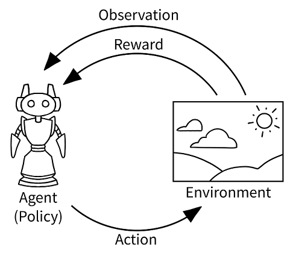
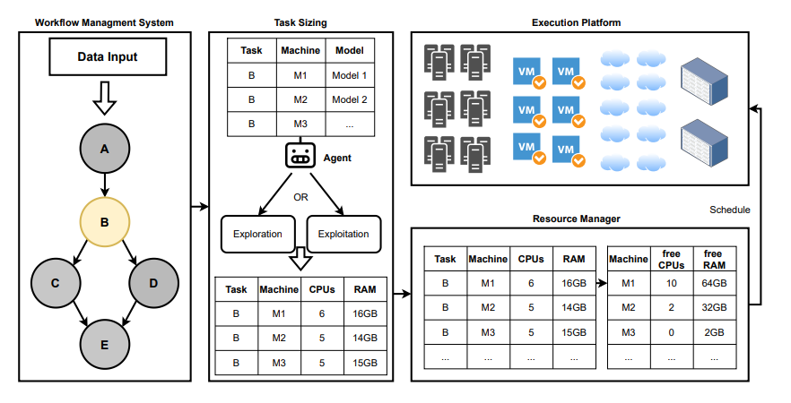
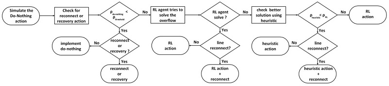

Did you know that your mobile device, IOS or Android has a built-in self-learning agent? Your iPhone learns from your daily charging habits to improve the lifespan of your battery. For Android, the company that stands behind these type of features - Deepmind, helped to make the system more energy efficient by creating Adaptive Battery and Adaptive Brightness.

Adaptive Battery: smart battery management system that uses machine learning to anticipate which apps you’ll need next, providing a more reliable battery experience.

Adaptive Brightness: personalized experience for screen brightness, built on algorithms that learn your brightness preferences in different surroundings.

These solutions are based on so-called Reinforcement Learning, which we will cover later. So if we can optimize the battery of the mobile device, can we do the same for industrial infrastructure? 

There are a few critical infrastructure sectors whose assets are considered vital. If such systems and assets were to become incapacitated or destroyed, it would severely impact security, business, or even health and safety. How can we make any infrastructure more robust, stable, and efficient?

In this post, we will cover the two biggest challenges that infrastructure may face - outages or inefficient energy consumption. We will also cover the role of Machine Learning in solving that issues. Reinforcement Learning in particular.

### So what is Reinforcement Learning?

Reinforcement Learning is a type of machine learning that allows an agent to learn through interaction with an environment by taking actions and receiving feedback in the form of rewards or punishments. 

In contrast to supervised learning, which provides the correct actions for completing a task, Reinforcement Learning uses rewards and punishments as indicators of positive and negative behavior. The goal here is to find an action model that maximizes the cumulative reward for the agent, while the goal of unsupervised learning is to identify similarities and differences between data points.

Some important terms that define the fundamental elements of this approach include:

- Environment: physical world in which the agent operates
- State: current situation of the agent
- Reward: feedback from the environment
- Policy: method for mapping the agent's state to actions
- Value: expected reward that the agent will receive by taking a particular action in a given state

### Making Data Center Greener with Reinforcement Learning: cooling optimization, CPU/Memory optimization 

The cooling system is a crucial part of a modern data center. Developing an optimal control policy for the data center cooling system can be challenging. Current approaches often rely on approximating the system based on knowledge of mechanical cooling, electrical systems, and thermal management, which can be difficult to design and may not perform optimally. 

In one of the most cited research papers, "Transforming Cooling Optimization for Green Data Center via Deep Reinforcement Learning" [1],  the authors proposed to use large amounts of monitoring data from the data center to optimize the control policy. To do this, they cast the cooling control policy design as an energy cost minimization problem with temperature constraints and use a deep reinforcement learning framework. 

Then they proposed an end-to-end cooling control algorithm (CCA) based on the actor-critic framework and an offline version of the deep deterministic policy gradient algorithm. The CCA uses an evaluation network trained to predict an energy cost that is penalized by the cooling status of the data center room and a policy network trained to predict optimized control settings based on current load and weather conditions. 

The proposed algorithm was tested on the EnergyPlus simulation platform and on real data collected from Singapore's National Super Computing Centre. The results showed that the CCA could achieve about 11% energy cost savings on the simulation platform compared to a baseline control algorithm and about 15% energy savings on the real data trace if the inlet temperature threshold is set at 26.6 degrees Celsius.

Another paper that was also published in November 2022 "Leveraging Reinforcement Learning for Task Resource Allocation in Scientific Workflows" [2],  covers another challenge that we may face, both on-premise, and cloud. 

They looked at Scientific workflow optimization. Scientific workflows are a series of interconnected tasks that are used to analyze large amounts of data. These workflows are often complex and can include thousands of tasks with varying computing requirements and long runtimes. 

To optimize the performance of these workflows, it is necessary to allocate the appropriate amount of resources, such as CPU and memory, to each task. However, accurately estimating the resources needed for each task can be difficult, leading to overprovisioning or underprovisioning. 

>For instance, assigning too much memory, although resulting in a successful task execution, might prevent further parallel tasks and, thus, unnecessarily decrease the overall throughput. In contrast, insufficient memory allocations can result in memory bottlenecks, i.e., memory swapping or even failed executions. Overprovisioning results in wasted resources, while underprovisioning can cause long runtimes or even failed tasks.

To address this problem, the paper proposes using reinforcement learning techniques, including gradient bandits and Q-learning, to allocate resources more accurately and reduce resource wastage. These approaches are implemented in the scientific workflow management system Nextflow and are evaluated using five different workflows. The results show that the proposed reinforcement learning approaches significantly reduce resource wastage compared to the default resource allocation method and reduce the total number of CPU hours needed compared to a state-of-the-art feedback loop baseline.

Moving next, one of the well-known events where RL meets real word problems is  "Learning to Run a Power Network" or L2RPN Challenge. 

### Gamify a search for AI-driven solutions to real-time power grid operations and what do you get?

The aim of this event is to encourage machine learning and power system specialists to compete and collaborate to develop a reinforcement learning-based agent -- or digital assistant - to monitor and control a synthetic power network, for normal network operation and when it is stressed with overloads or disturbances. 

And recently, on 5th of December 2022, the authors published all the details of one of the approaches called PowRL that helps mitigate the effects of unexpected network events and maintain reliable electricity throughout the network. [3] 

PowRL uses a novel heuristic for overload management and RL-guided decision making to ensure that the grid is operated safely and efficiently. 

One of the challenges that authors faced during this competition is working with a very large action space (comprising nearly 70k actions) which is not practical, even with AI-guided solutions. To address this, they idetified certain substations, that contain a relatively larger number of control elements and offer more flexibility in terms of controlling power networks. Through simulations, they identified a smaller action set of 240 actions that had the greatest impact on network control. This set consists only of topological control and does not include costly generation production actions, as inexpensive topological changes alone were sufficient to respond to various contingency events.

Other than building an RL agent to select a top-performing (electrically) valid action, they also introduced some baseline heuristics to support the RL agent.

On top of that, they used the Proximal Policy Optimization (PPO) guided Reinforcement Learning framework - to learn optimal sequential decision-making. To do this, they trained an on-policy PPO agent using a prioritized replay buffer based on the set of network states. The state of the agent at time step t, includes information about the time step (such as the month, date, hour, minute, and day of the week), generator features (such as active and reactive generation and voltage magnitude), load features (such as active and reactive consumption and voltage magnitude), line features (such as active and reactive power flows, bus voltages and current flows at both ends of the line, the capacity of the power flow, the duration of time steps since a line has overflowed, and the status of the line), the topological vector status indicating which bus each object in the power grid is connected to in the substation, line and substation cooldown time steps, and information about planned maintenance for power lines. 

The framework has been tested on multiple datasets from the L2RPN and has achieved state-of-the-art performance in various test scenarios, including topping the leaderboard in the L2RPN NeurIPS 2020 challenge (Robustness track) and being the top performing agent in the L2RPN WCCI 2020 challenge.

There are many more ways of applying the same RL for cloud instances, for instance, Amazon engineers recently published in "Predict-and-Critic: Accelerated End-to-End Predictive Control for Cloud Computing through Reinforcement Learning".  

Cloud computing holds the promise of reduced costs through economies of scale. To realize this promise, cloud computing vendors typically solve sequential resource allocation problems, where customer workloads are packed on shared hardware. Virtual machines (VM) form the foundation of modern cloud computing as they help logically abstract user compute from shared physical infrastructure. Traditionally, VM packing problems are solved by predicting demand, followed by a Model Predictive Control (MPC) optimization over a future horizon. In this work, authors improved the approach by proposing the Predict-and-Critic (PnC) framework. [4]

NVIDIA adressed the problem of increased congestion and degradation in performance of cloud datacenters due to higher utilization of communication protocols. Authors examined a reinforcement learning congestion control algorithm that has been shown to achieve excellent results and adapt it to comply with current hardware constraints. By mapping complex policies onto a low-compute architecture, they were able to significantly reduce latency by a factor of 500. [5]

Reinforcement Learning has shown advancement in solving sophisticated problems in real-world. As we may see, the increasing demand for digital services has led to a significant increase in energy consumption by data centers, which has negative environmental impacts. To address this issue, it is important to find sustainable solutions to the energy and digital infrastructure challenges. If you want to learn more, it's good to start exploring Gymnasium. Gymnasium is a maintained fork of OpenAI’s Gym library. The Gymnasium interface is simple, pythonic, and capable of representing general RL problems, and has a compatibility wrapper for old Gym environments. 
 
https://gymnasium.farama.org/

[1] Transforming Cooling Optimization for Green Data Center via Deep Reinforcement Learning Yuanlong Li, Yonggang Wen, Kyle Guan, Dacheng Tao https://doi.org/10.48550/arXiv.1709.05077

[2] Leveraging Reinforcement Learning for Task Resource Allocation in Scientific Workflows Jonathan Bader, Nicolas Zunker, Soeren Becker, Odej Kao https://doi.org/10.48550/arXiv.2211.12076

[3] PowRL: A Reinforcement Learning Framework for Robust Management of Power Networks Chauhan, Anandsingh ; Baranwal, Mayank ; Basumatary, Ansuma
https://ui.adsabs.harvard.edu/abs/2022arXiv221202397C

[4] Predict-and-Critic: Accelerated End-to-End Predictive Control for Cloud Computing through Reinforcement Learning Kaustubh Sridhar, Vikramank Singh, Balakrishnan Narayanaswamy, Abishek Sankararaman
https://doi.org/10.48550/arXiv.2212.01348

[5] Implementing Reinforcement Learning Datacenter Congestion Control in NVIDIA NICs  Benjamin Fuhrer , Yuval Shpigelman , Chen Tessler , Shie Mannor, Gal Chechik, Eitan Zahavi , Gal Dalal NVIDIA Networking, NVIDIA Research, Technion Institute of Technology, Bar-Ilan University https://doi.org/10.48550/arXiv.2207.02295

