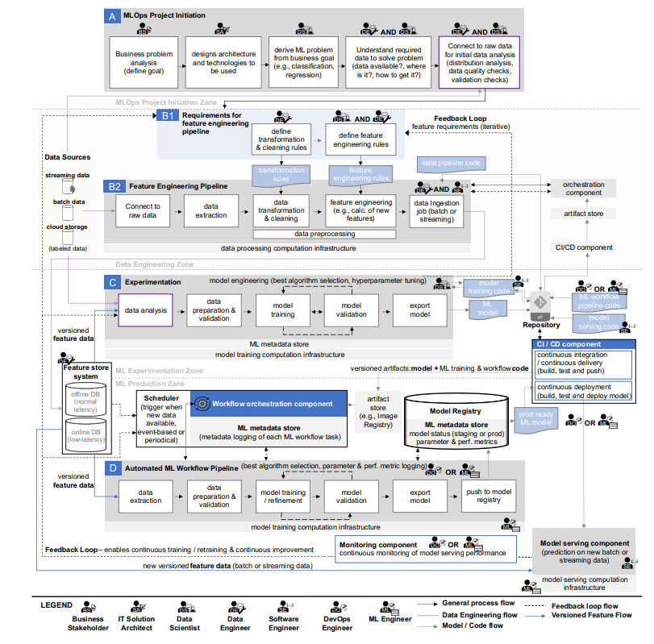

In recent years, the concept of DevOps has gained popularity as a way to address issues in software development and improve collaboration, and knowledge sharing between development and operations teams. DevOps emphasizes automation through continuous integration, continuous delivery, and continuous deployment (CI/CD), which enables fast and reliable releases. It also promotes continuous testing, quality assurance, monitoring, and feedback to ensure the ongoing success of the software.

The adoption of continuous software engineering practices, like DevOps, has allowed organizations to quickly deploy new features as they are developed, leading to more frequent updates to their systems. With a growing interest in applying these practices to the rapid deployment of machine learning features, majority started using MLOps terminology.

### MLOps definition 

The term MLOps can be defined as “the extension of the DevOps methodology to include Machine Learning and Data Science assets as first-class citizens within the DevOps ecology” [1]

While this statement is true, we're still missing few important concepts. More detailed explanation was mentioned in "Machine Learning Operations (MLOps): Overview, Definition, and Architecture" paper [2]:

>MLOps (Machine Learning Operations) is a paradigm, including aspects like best practices, sets of concepts, as well as a development culture when it comes to the end-to-end conceptualization, implementation, monitoring, deployment, and scalability of machine learning products. 

>Most of all, it is an engineering practice that leverages three contributing disciplines: machine learning, software engineering (especially DevOps), and data engineering. MLOps is aimed at productionizing machine learning systems by bridging the gap between development (Dev) and operations (Ops).

>Essentially, MLOps aims to facilitate the creation of machine learning products by leveraging these principles: CI/CD automation, workflow orchestration, reproducibility; versioning of data, model, and code; collaboration; continuous ML training and evaluation; ML metadata tracking and logging; continuous monitoring; and feedback loops.

This is more precise explanation that covers majority of the items from MLOps lifecycle. But before starting thinking of MLOps, it's better to review the organization's ML/AI maturity level.

At early stages, organization may hire data scientist to tackle all the features of MLOps. That means that the person will work not only on hypothesis testing, data exploration, and creating POC, but also do all the engineering tasks like setting up model training infrastructure, model serving component, monitoring component and others. In optimistic scenario, this will increase the duration of any project as it requires a lot more time to acompllish all the milestones. In a more realistic scenario, employee turnover will be very high 
as business expectations and the capabilities wouldn't fit together.

### Roles: is there such a thing as a Data Scientist?

When we are considering MLOps as team, there are several roles that work together to develop and operate machine learning products:

Business Stakeholder (similar roles: Product Owner, Project Manager): This role defines the business goal to be achieved with ML and handles the communication aspects, such as presenting the return on investment (ROI) generated by the ML product.

Solution Architect (similar role: IT Architect): This role designs the architecture and defines the technologies to be used, following a thorough evaluation.

Data Scientist (similar roles: ML Engineer, ML Developer): This role translates the business problem into an ML problem and handles model engineering, including selecting the best-performing algorithm and hyperparameters.

Data Engineer (similar role: DataOps Engineer): This role builds and manages data and feature engineering pipelines, and ensures proper data ingestion to the databases of the feature store system.

Software Engineer: This role applies software design patterns, coding guidelines, and best practices to turn the raw ML problem into a well-engineered product.

DevOps Engineer: This role bridges the gap between development and operations, and ensures proper CI/CD automation, ML workflow orchestration, model deployment to production, and monitoring.

ML Engineer/MLOps Engineer: This role combines aspects of several roles and has cross-domain knowledge, including skills from data scientists, data engineers, software engineers, DevOps engineers, and backend engineers. This role builds and operates the ML infrastructure, manages the automated ML workflow pipelines and model deployment to production, and monitors both the model and the ML infrastructure.

End-to-end MLOps architecture and workflow with functional components and roles. Machine Learning Operations (MLOps): Overview, Definition, and Architecture. Dominik Kreuzberger, Niklas Kühl, Sebastian Hirschl

In Microsoft's "AI Maturity and organizations" white paper written by Eric Charran – Chief Architect Data & AI and Steve Sweetman – Director AI Programs, authors explained the most important milestones and patterns of the company's maturity evolution. [3]

### Foundational organizations

Foundational organizations are focused on understanding the basics of artificial intelligence (AI) and its potential applications. They may seek to learn from others in their industry who are already using AI and work to develop systems and processes that support data-driven decision-making. At this stage, they may rely more on the experience and instincts of leaders to make decisions, rather than utilizing historical analytical systems. In order to successfully adopt AI, foundational organizations should invest in fast, iterative experimentation and work to develop a data-driven culture that empowers their members and fosters a growth mindset. They may also consider adopting AI technologies hosted by organizations like Microsoft, which can abstract ownership and operational challenges and allow them to grow into a digital business.

### Approaching organizations

Approaching organizations are in the process of implementing cultural changes that support data-driven decision-making and empower their employees. They are focused on adopting a data culture and using AI to create new business models and streamline operational processes. Thanks to their efforts to digitize assets and automate processes, these organizations are ready to consider owning custom AI solutions. They have demonstrated the ability to implement solutions through quick iterative sprints and value learning from their efforts. They are also prepared to embrace rapid experimentation and invest more in understanding how to implement, monitor, and improve AI over time.

### Aspirational organizations 

Aspirational organizations recognize the importance of artificial intelligence (AI) in helping them compete and transform. They may be aware of other organizations using AI and are concerned about potential competitive disruption or industry disruption by other competitors. These organizations are often on a journey towards digital transformation, working to improve processes and use data to inform their decisions. They are focused on shifting their culture to empower employees, which can increase collaboration, generate ideas for optimization, and help to create new business models. Aspirational organizations are becoming more comfortable with taking risks and transitioning away from sequential, fixed projects to more iterative projects.

### Mature organizations

Mature organizations have fully embraced a culture of lifelong learning and a growth mindset, and are able to easily conduct rapid, iterative experiments. They have established strategic initiatives as part of their fully embraced data culture, which helps them translate insights into action. These organizations are skilled at recruiting AI creation talent and understand how to apply these resources to multiple AI initiatives at once. They also have a strong understanding of how to create digital experiences that are impactful over time and consider ethical perspectives when creating these experiences, asking themselves whether certain AI applications are appropriate or not.

In paper "Who Needs MLOps: What Data Scientists Seek to Accomplish and How Can MLOps Help?" [4], authors studied the importance of MLOps in the context of data scientists’ daily activities. As concrete results, they presented a survey representing responses from 331 professionals working in the ML domain, indicating on what they were working on in the last three months, and study the role MLOps might play in their daily activities.

According to the survey results, up to 40% of respondents work with both models and infrastructure, with the majority of their work involving relational and time series data. The most common types of problems they need to solve are related to predictive analysis, time series data, and computer vision. The biggest perceived challenges are data-related, although there is also some awareness of issues with deploying models to production and related procedures. Based on these findings, they hypothesized that the companies represented in the survey can be divided into three categories: 

- companies that discovering how to best use data
- companies that focused on building and deploying their first models 
- companies that are already managing multiple models, versions and training datasets, as well as retraining and frequent deployment of retrained models
 
Not thinking about the tech giants, obviosly that the majority of companies are still in the first two categories, focusing on data and model. However,  the benefits of MLOps are more apparent in third category, when there is a need for frequent retraining and redeployment. 

As a result, setting up an MLOps pipeline is a logical step for companies moving from using machine learning as a proof-of-concept to using it as a regular part of their activities. Creating an AI-based system requires a level of organizational maturity to accommodate the development process. 

To successfully integrate artificial intelligence into digital experience, companies must adopt an experiment-driven mindset and understand the non-deterministic outcomes associated with AI development. They must also effectively manage small iterations and be prepared to explain and attest to the effectiveness and accuracy of the model prior to deployment. Developments in transparent algorithms and explainability frameworks can help companies build trust in the efficacy of their models. After deployment, companies should have a plan for continued monitoring, retraining, and evaluation of the model, as well as practices, orchestration substrates, governance models, and systems of accountability in place to ensure its operational effectiveness.

[1] https://github.com/cdfoundation/sig-mlops/blob/master/roadmap/2020/MLOpsRoadmap2020.md 

[2] Machine Learning Operations (MLOps): Overview, Definition, and Architecture. Dominik Kreuzberger, Niklas Kühl, Sebastian Hirschl. https://doi.org/10.48550/arXiv.2205.02302 

[3] https://query.prod.cms.rt.microsoft.com/cms/api/am/binary/RE4DIvg

[4] Who Needs MLOps: What Data Scientists Seek to Accomplish and How Can MLOps Help? Sasu Mäkinen, Henrik Skogström, Eero Laaksonen, Tommi Mikkonen. https://doi.org/10.48550/arXiv.2103.08942 

