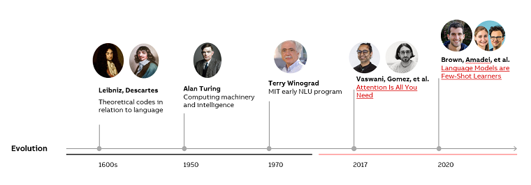
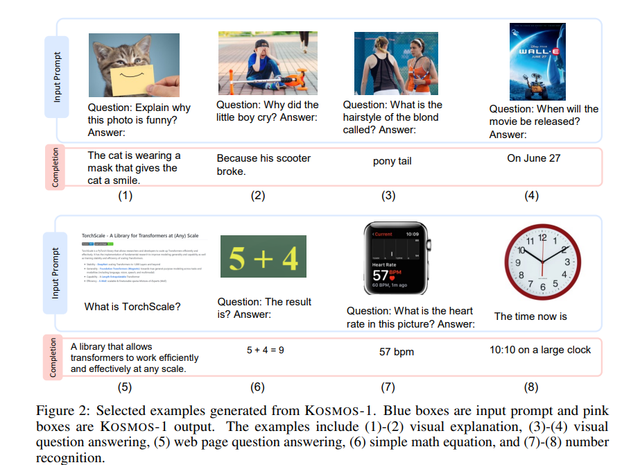

Generative models have been around for a long time and were used to generate sequential data, like speech and time series. In natural language processing (NLP), a traditional method to generate sentences was to learn the distribution of words and then find the best sequence. However, this method wasn't very practical for longer sentences. To solve this problem, neural networks were introduced for language modeling tasks. These allowed for modeling relatively long dependency in language. And later, scientists introduced the next generation of models and mechanisms to control memory during training, which made the models even better at generating language. 

These models in different domains have taken different paths but eventually converged at the transformer architecture (Attention is all you need) introduced in 2017 by the Google Brain team. The transformer has become the dominant building block for many generative models in natural language processing and computer vision. Even ChatGPT and GPT models (including GPT 4) are still using transformer architecture inside. The emergence of transformer-based models has revolutionized AI generation and allowed for large-scale training.

In simple terms, Generative AI stands for using special models that can learn from human instructions and generate content based on those instructions. This process involves two main steps: understanding what the human wants and creating something that meets that request. This approach is not new, but recent technological advances have allowed for more sophisticated and powerful models to be trained on larger amounts of data. For example, GPT-3 from OpenAI or PaLM from Google is an improvement over previous models because it has been trained on more data and uses a larger model architecture, which makes it better at understanding what humans want and generating content to meet their requests. One dataset used to train such a model can contain 43M instructions.

What is also interesting is that the model can learn from feedback given by humans (called reinforcement learning from human feedback). This helps the program become more reliable and accurate over time when responding to instructions. ChatGPT can use this approach to better understand what humans prefer in more extended conversations. In the field of computer vision, a new technique called stable diffusion was developed by a company called Stability.AI in 2022. This approach has been successful in generating high-quality images by balancing the trade-off between exploring new possibilities and using what it has learned from past experiences. This results in images that are both diverse and similar to the original training data.

Currently, what we are using is called unimodal generative models. These models are designed to accept a specific raw data modality as input, such as text or images, and then generate predictions in the same modality as the input. But all the research labs are working on new multimodal models. 

Multimodal generation is about creating a model that can generate different types of content by understanding how they relate to each other. This can be tricky because there are many complex connections between the different types of content. But with recent advances in technology, there are now more ways to tackle this challenge. For example, the latest models can generate and operate with text, images, audio, graphs, 3d scene reconstruction, or code. Very recent example that leverages this technology is GPT-4 model.

KOSMOS-1 a Multimodal Large Language Model (MLLM) that can perceive
general modalities, learn in context, and follow instructions https://arxiv.org/pdf/2302.14045.pdf
By the way, Kosmos-2 was also introduced few days ago. https://github.com/microsoft/unilm/tree/master/kosmos-2

Inside GPT-4, a system called Visual ChatGPT, incorporating different Visual Foundation Models, that enables the user to interact with the model by 1) sending and receiving not only languages but also images 2) providing complex visual questions or visual editing instructions that require the collaboration of multiple AI models with multi-steps. 3) providing feedback and asking for corrected results. We can use this system in a way where the model will help us extract the information from the image, guide the user on what to do next with it, or even take some simple action based on the extracted information.  

### So, what is next?

We're moving towards AGI - Artificial General Intelligence. The model will be able to use tools, and software, search for the right information, build trust, negotiate, and cooperate with humans. But to be ready for that, we must consider a few things.

As AI becomes more widespread, concerns have arisen about potential bias and ethical implications. One worry is that AI-generated content, such as language or images, may amplify existing societal biases. This could adversely affect areas such as hiring or loan approvals, perpetuating discrimination and inequities. This can be solved by having more transparency.  Keeping code, datasets, and models private hinders the overall progress in keeping AI systems safe. By sharing such information, users and researchers alike can point out the harms and potential solutions in these multifaceted systems.

-2017-2021: base models predicting next word. Still compelling and cost-effective models for downstream tasks and advanced analysis of any unstructured information

-2022: large models trained on millions of tasks. Next generation of Large Language Models that can generalize on unseen tasks and outperform basic models in content creation

-2023: towards Artificial General Intelligence. Models that can use tools, search for information, operate with multiple modalities, and learn from AI feedback 

In the world of technology, there is a race to create AI models (for instance, on March 14th, 2023, both Open AI, Anthropic, and Google released APIs for their new models on the same day). This poses a threat to industry leaders who are slow to adapt. Models-as-a-Service (MaaS) vendors will emerge to provide foundational models that businesses can build upon, making it easier and more affordable to develop new AI applications. However, some industries require more accurate models than the foundational ones provided by MaaS companies.

AI regulations may slow down innovation and adoption, but it's still unclear whether the most popular models will come from open-source communities or licensed cloud-based software companies. Companies like Stability AI and OpenAI are taking different approaches to license their AI models. It remains to be seen how Google, Meta, and other companies will approach their offerings. 

The costs associated with creating and training these AI models are high, but developers are incentivized to push these applications to the edge, which means running them on devices instead of in the cloud. Apple has already optimized its operating systems to run AI apps on the device, which raises the question of how quickly other developers will follow suit. Moreover, recently we've seen a Large Language Model equal to one of the GPTs (that now available only in the cloud) was running on a Macbook.

Despite these uncertainties, AI has the potential to accelerate economic growth, increase abundance, and lead to new scientific discoveries that challenge our understanding of what is possible.